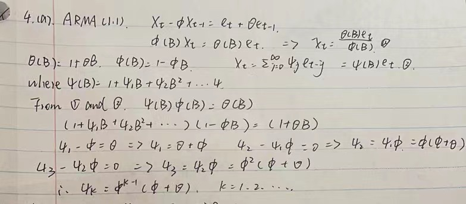

```{r setup, include=FALSE}
knitr::opts_chunk$set(echo = TRUE)
```

#1
##(i)
```{r}
par(mfrow=c(2,2))
y = ARMAacf(ar = c(1.1,0.3), lag.max = 20)
y = y[2:21]
plot(y, x = 1:20, type = "h", ylim = c(-1,1), xlab = "h", ylab = "Autocorrelation", main = "AR(2) Population ACF")
abline(h = 0)
y = ARMAacf(ar = c(1.1, 0.3), lag.max = 20,pacf=T)
plot(y, x = 1:20, type = "h", ylim = c(-1,1), xlab = "h",
ylab = "Partial Autocorrelation", main = "AR(2) Population PACF")
abline(h = 0)
```

##(ii)
```{r}
y = ARMAacf(ar = c(-1.1,0.3), lag.max = 20)
y = y[2:21]
plot(y, x = 1:20, type = "h", ylim = c(-1,1), xlab = "h", ylab = "Autocorrelation", main = "AR(2) Population ACF")
abline(h = 0)
y = ARMAacf(ar = c(-1.1,0.3), lag.max = 20, pacf=T)
plot(y, x = 1:20, type = "h", ylim = c(-1,1), xlab = "h", ylab = "Partial
Autocorrelation", main = "AR(2) Population PACF")
abline(h = 0)
```

##(iii)
```{r}
par(mfrow=c(2,2))
y = ARMAacf(ar = c(1.1,-0.3), lag.max = 20)
y = y[2:21]
plot(y, x = 1:20, type = "h", ylim = c(-1,1), xlab = "h", ylab = "Autocorrelation", main = "AR(2) Population ACF")
abline(h = 0)
y = ARMAacf(ar = c(1.1,-0.3), lag.max = 20, pacf=T)
plot(y, x = 1:20, type = "h", ylim = c(-1,1), xlab = "h", ylab = "Partial
Autocorrelation", main = "AR(2) Population PACF")
abline(h = 0)
```

##(iv)
```{r}
y = ARMAacf(ar = c(-1.1,-0.3), lag.max = 20)
y = y[2:21]
plot(y, x = 1:20, type = "h", ylim = c(-1,1), xlab = "h", ylab = "Autocorrelation", main = "AR(2) Population ACF")
abline(h = 0)
y = ARMAacf(ar = c(-1.1,-0.3), lag.max = 20, pacf=T)
plot(y, x = 1:20, type = "h", ylim = c(-1,1), xlab = "h", ylab = "Partial
Autocorrelation", main = "AR(2) Population PACF")
abline(h = 0)
```
#2
##3.1
````{r fig1, echo=FALSE, fig.cap="Problem 2 (3.1)", out.width = '100%'}

```


## 3.2(a)
````{r fig2, echo=FALSE, fig.cap="Problem 2 (3.2)", out.width = '100%'}


```

```{r}
a <- ARMAacf(ar =c(-0.2,0.48), ma = 0, lag.max = 5)
b <- ARMAacf(ar =c(-0.2,0.48), ma = 0, lag.max = 5,pacf=T)
print(a)
print(b)
plot(a, type='h', main='ACF for ARMA(2,0)')
plot(b, type='h', main='PACF for ARMA(2,0)')
```

##3.2(d)
```{r}
a <- ARMAacf(ar =c(-1.8,-0.81), ma = 0, lag.max = 5)
b <- ARMAacf(ar =c(-1.8,-0.81), ma = 0, lag.max = 5,pacf=T)
print(a)
print(b)
plot(a, type='h', main='ACF for ARMA(2,0)')
plot(b, type='h', main='PACF for ARMA(2,0)')
```
##3.4
````{r fig3, echo=FALSE, fig.cap="Problem 2 (3.4)", out.width = '100%'}

```
#3(a)
````{r fig4, echo=FALSE, fig.cap="Problem 3 (a)", out.width = '100%'}

```

#3(b)
````{r fig5, echo=FALSE, fig.cap="Problem 3(b)", out.width = '100%'}

```


```{r}
ARMAtoMA(ar = c(1.1,-0.3), ma = 0, lag.max = 5)
```
#3(c)
````{r fig6, echo=FALSE, fig.cap="Problem 3(c)", out.width = '100%'}

```

```{r}
ARMAacf(ar =c(1.1,-0.3), ma = 0, lag.max = 5)
```
#3(d)
````{r fig7, echo=FALSE, fig.cap="Problem 3 (d)", out.width = '100%'}


```

```{r}
ARMAacf(ar =c(1.1,-0.3),ma=0, lag.max = 5,pacf=T)
```
#4
````{r fig8, echo=FALSE, fig.cap="Problem 4 (a)", out.width = '100%'}

```
````{r fig9, echo=FALSE, fig.cap="Problem 4 (b)", out.width = '100%'}


```


```{r}
ARMAtoMA(ar =0.6, ma = -0.2, lag.max = 5)
```
#5(a)
````{r fig10, echo=FALSE, fig.cap="Problem 5 (a)", out.width = '100%'}


```

```{r}
ARMAacf(ar =0, ma =c(0.8,-0.15), lag.max = 5)
```
#5(b)
````{r fig11, echo=FALSE, fig.cap="Problem 5 (b)", out.width = '100%'}


```


```{r}
ARMAacf(ar =0, ma =c(0.8,-0.15), lag.max = 5,pacf=T)
```
#6
````{r fig12, echo=FALSE, fig.cap="Problem 6", out.width = '100%'}

```

