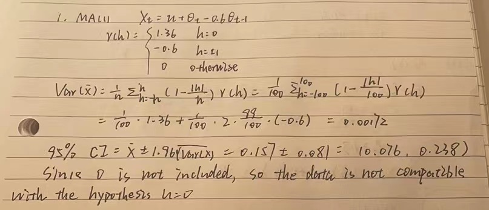
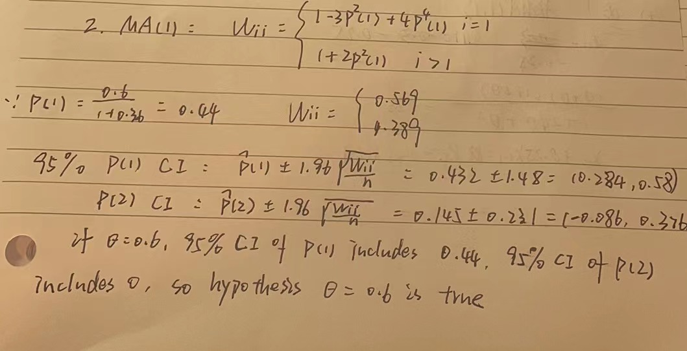
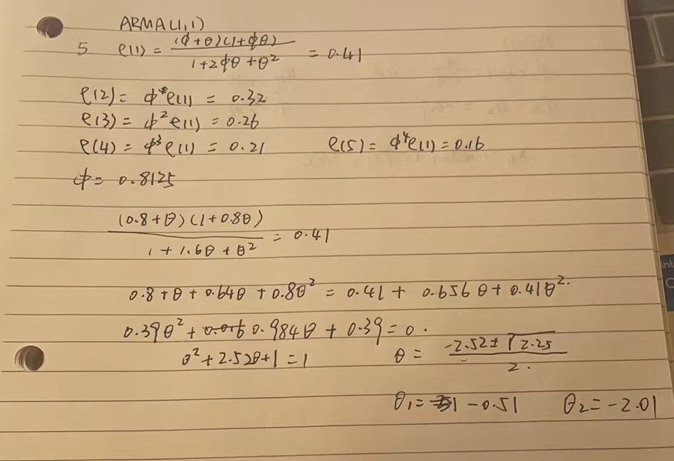
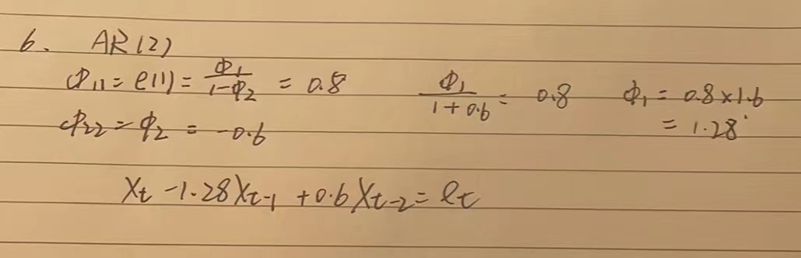

```{r setup, include=FALSE}
knitr::opts_chunk$set(echo = TRUE)
```

#1
```{r fig1, echo=FALSE, fig.cap="Problem 1", out.width = '100%'}


```
#2
```{r fig2, echo=FALSE, fig.cap="Problem 2", out.width = '100%'}

```


#3
##AR(2)
```{r}
x=arima.sim(n=100, list(ar=c(1.5,-0.75)))
plot.ts(x)
title(main="Simulated Data from the AR(2) Process X(t)-1.5X(t-1)+0.75X(t-
2)=e(t)")
par(mfrow=c(2,2))
y = ARMAacf(ar=c(1.5,-0.75),lag.max = 20)
y = y[2:21]
plot(y, x = 1:20, type = "h", ylim = c(-1,1), xlab = "h",
ylab = "Autocorrelation", main = "AR(2) Population ACF")
abline(h = 0)
y = ARMAacf(ar=c(1.5,-0.75),lag.max = 20,pacf=T)
plot(y, x = 1:20, type = "h", ylim = c(-1,1), xlab = "h",
ylab = "Partial Autocorrelation", main = "AR(2) Population PACF")
abline(h = 0)
acf(x,main="Sample ACF", ylim = c(-1,1))
pacf(x,main="Sample PACF", ylim = c(-1,1))
```
##ARMA(1,1)
```{r}
x=arima.sim(n=100, list(ar=0.5,ma=-0.75))
plot.ts(x)
title(main="Simulated Data from the ARMA(1,1) Process X(t)-0.5X(t-1)=e(t)-0.75e(t-1)")
par(mfrow=c(2,2))
y = ARMAacf(ar=0.5,ma=-0.75,lag.max = 20)
y = y[2:21]
plot(y, x = 1:20, type = "h", ylim = c(-1,1), xlab = "h",
ylab = "Autocorrelation", main = "ARMA(1,1) Population ACF")
abline(h = 0)
y = ARMAacf(ar=0.5,ma=-0.75,lag.max = 20,pacf=T)
plot(y, x = 1:20, type = "h", ylim = c(-1,1), xlab = "h",
ylab = "Partial Autocorrelation", main = "ARMA(1,1)) Population PACF")
abline(h = 0)
acf(x,main="Sample ACF", ylim = c(-1,1))
pacf(x,main="Sample PACF", ylim = c(-1,1))
```
##MA(1)
```{r}
x=arima.sim(n=100, list(ma=1.5))
plot.ts(x)
title(main="Simulated Data from the MA(1) Process X(t)=e(t)+1.5e(t-1)")
par(mfrow=c(2,2))
y = ARMAacf(ar=0,ma=1.5,lag.max = 20)
y = y[2:21]
plot(y, x = 1:20, type = "h", ylim = c(-1,1), xlab = "h",
ylab = "Autocorrelation", main = "MA(1) Population ACF")
abline(h = 0)
y = ARMAacf(ar=0,ma=1.5,lag.max = 20,pacf=T)
plot(y, x = 1:20, type = "h", ylim = c(-1,1), xlab = "h",
ylab = "Partial Autocorrelation", main = "MA(1) Population PACF")
abline(h = 0)
acf(x,main="Sample ACF", ylim = c(-1,1))
pacf(x,main="Sample PACF", ylim = c(-1,1))
```
## ARMA(1,2)
```{r}
x=arima.sim(n=100, list(ar=0.5,ma=c(0.6,1.2)))
plot.ts(x)
title(main="Simulated Data from the ARMA(1,2) Process X(t)-0.5X(t-1)=e(t)+0.6e(t-1)+1.2e(t-2)")
par(mfrow=c(2,2))
y = ARMAacf(ar=0.5,ma=c(0.6,1.2),lag.max = 20)
y = y[2:21]
plot(y, x = 1:20, type = "h", ylim = c(-1,1), xlab = "h",
ylab = "Autocorrelation", main = "ARMA(1,2) Population ACF")
abline(h = 0)
y = ARMAacf(ar=0.5,ma=c(0.6,1.2),lag.max = 20,pacf=T)
plot(y, x = 1:20, type = "h", ylim = c(-1,1), xlab = "h",
ylab = "Partial Autocorrelation", main = "ARMA(1,2)) Population PACF")
abline(h = 0)
acf(x,main="Sample ACF", ylim = c(-1,1))
pacf(x,main="Sample PACF", ylim = c(-1,1))
```

#4
##(a)
X(t)+0.7X(t-1)=et
```{r}
a=arima.sim(n=100, list(ar=-0.7))
acf(a,main="ACF",ylim=c(-1,1),xaxp=c(0,20,10))
pacf(a,main="PACF",ylim=c(-1,1),xaxp=c(0,20,10))
```

##(b)
e(t)-0.5e(t-1)=X(t)
```{r}
b=arima.sim(n=100, list(ma=-0.5))
acf(b,main="ACF",ylim=c(-1,1),xaxp=c(0,20,10))
pacf(b,main="PACF",ylim=c(-1,1),xaxp=c(0,20,10))
```

##(c)
X(t)-1.3X(t-1)+0.75X(t-2)=e(t)
```{r}
a=arima.sim(n=100, list(ar=c(1.3,-0.75)))
acf(a,main="ACF",ylim=c(-1,1),xaxp=c(0,20,10))
pacf(a,main="PACF",ylim=c(-1,1),xaxp=c(0,20,10))
```

##(d)
X(t)+0.25X(t-1)=e(t)-0.65e(t-1)
```{r}
a=arima.sim(n=100, list(ar=-0.25,ma=-0.65))
acf(a,main="ACF",ylim=c(-1,1),xaxp=c(0,20,10))
pacf(a,main="PACF",ylim=c(-1,1),xaxp=c(0,20,10))
```


#5
X(t)-0.8X(t-1)=e(t)-0,5e(t-1)
```{r}
ARMAacf(ar =0.8,ma=-0.5,lag.max = 5)
ARMAacf(ar =0.8,ma=-0.5,lag.max = 5,pacf=T)
a=arima.sim(n=100, list(ar=0.8,ma=-0.5))
acf(a,main="ACF",ylim=c(-1,1),xaxp=c(0,20,10))
pacf(a,main="PACF",ylim=c(-1,1),xaxp=c(0,20,10))
```

```{r fig3, echo=FALSE, fig.cap="Problem 5", out.width = '100%'}

```

#6
```{r fig4, echo=FALSE, fig.cap="Problem 6", out.width = '100%'}

```


#7
##(i)
```{r}
plot.ts(sunspot.year)
```
It's seems to be seasonal.
##(ii)
```{r}
 newsunspot <- sqrt(sunspot.year)
plot.ts(newsunspot)
```
square-root transformation makes the variation more uniform.
##(iii)
```{r}
acf(newsunspot,ylim=c(-1,1))
pacf(newsunspot,ylim=c(-1,1))
```
Xt-1.36X(t-1)+0.7X(t-2)=e(t)
```{r}
a=arima.sim(n=100, list(ar=c(1.36,-0.7)))
acf(a,main="ACF",ylim=c(-1,1),xaxp=c(0,20,10))
pacf(a,main="PACF",ylim=c(-1,1),xaxp=c(0,20,10))
```

